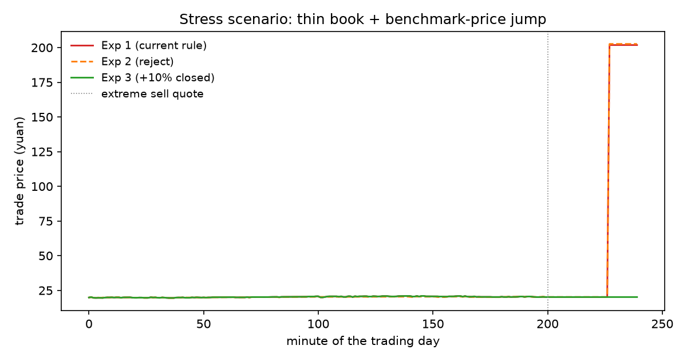
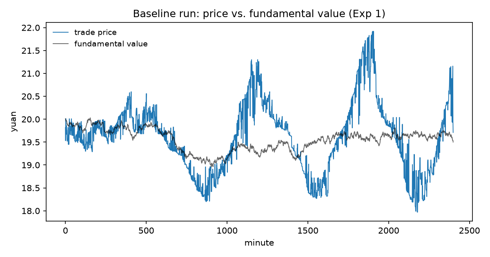

# Replication: the effective-bidding-range experiments

This folder is a **public reimplementation**, in Python, of the
artificial-stock-market model specified in the model-design appendix of SZSE
internal research report No. 378 on the effective bidding range (Dec 2020).
The original experiment code remains at the institute; this reimplementation
was written from the report's published equations and mechanism descriptions
so that the study's design — and its central result — can be inspected and
re-run by anyone.

```
pip install matplotlib
python run_experiments.py        # ~2 minutes: 3 experiments x 30 runs + figures
```

## What is implemented

Every equation in the report's appendix maps to a tagged site in
[`absm.py`](absm.py) — search the file for `Eq.`:

- **Investors (Eqs. 1–13).** 1,500 agents; chartist strength `gc_i = 2·gc₀·φ`
  drives each agent's horizon `τ_i = τmax/(1+gc_i)`, Poisson arrival rate
  `1/τ_i`, and risk aversion `α_i = α₀/(1+gc_i)`. Forecast = fundamental +
  noise + chartist momentum (Eq. 4); perceived variance is the harmonic blend
  of fundamental and realized market variance (Eq. 7); target position
  `W·π/P` (Eq. 11); market-vs-limit order choice per the report's order table
  with slippage buffer `δ = 0.04·p` (Eq. 13).
- **Market.** Continuous double auction with price–time priority; no daily
  price limit (ChiNext first-five-days regime); intraday halts at ±30% / ±60%
  vs. the day's open; T+1 (shares bought today cannot be sold today); no
  short selling.
- **The mechanism under study.** Buy limits capped at 102% of the buy
  benchmark, sell limits floored at 98% of the sell benchmark, with the
  benchmark cascade *counterparty best → own best → last trade → previous
  close*. Out-of-range orders are **parked** and auto-released when they
  re-enter the range (Exp 1), or **rejected** (Exp 2). Exp 3 adds a second,
  closed ±10% band anchored to the last trade price.

## Results

Baseline, means over 30 runs × 10 simulated days (240 min/day):

| metric | Exp 1 (current rule) | Exp 2 (reject) | Exp 3 (+10% closed) |
|---|---:|---:|---:|
| trade-price vol (bp/min) | 84.75 | 53.27 | 84.71 |
| midquote vol (bp/min) | 45.80 | 26.53 | 45.72 |
| bid–ask spread (cents) | 16.34 | 12.05 | 16.33 |
| volume (lots) | 29,312 | 24,607 | 29,316 |
| MAE vs fundamental (yuan) | 0.403 | 0.211 | 0.403 |
| MRE vs fundamental (%) | 1.99 | 1.04 | 1.99 |

Stress scenario — a thin late-session book, sellers withdrawn, one extreme
limit sell at 10× the market, then aggressive buyers chasing whatever the
range admits (same seed across mechanisms):

| | Exp 1 | Exp 2 | Exp 3 |
|---|---:|---:|---:|
| max trade price (yuan, from ≈20) | **201.80** | **202.60** | 20.98 |





## How this compares with the report

The report's two central findings reproduce:

1. **The parking rule is not the cause of the jumps.** The stress-scenario
   jump occurs under the current mechanism *and* under the reject variant —
   removing parking does not remove the risk.
2. **A closed band anchored to the last trade price prevents the jumps**, at
   no material cost in normal conditions (Exp 3 ≈ Exp 1 on every baseline
   metric). The open range fails because its benchmark is a *quote* that a
   single extreme order can move; anchoring to a *trade* breaks that loop.

Directional agreement in the baseline: rejecting instead of parking lowers
volatility and volume and improves pricing efficiency, as in the report.

Honest divergences: absolute magnitudes differ from the report (different
run length, endowments, and simplifications), and in this reimplementation
the reject variant *narrows* the spread where the report found it widened —
plausibly because agents here replace their standing order on every arrival,
so the book replenishes faster than in the original model. The point of this
folder is the mechanism logic and the reproducibility of the qualitative
result, not the exact numbers.
